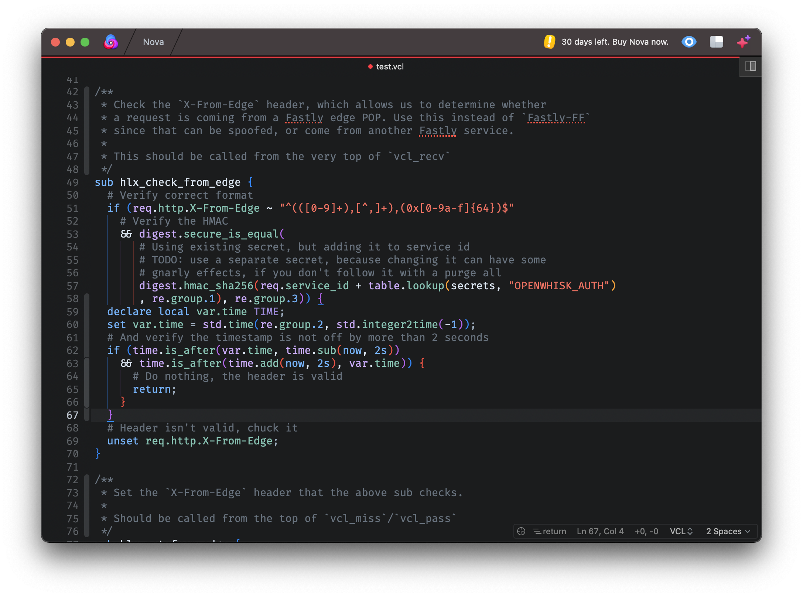

<!--
👋 Hello! As Nova users browse the extensions library, a good README can help them understand what your extension does, how it works, and what setup or configuration it may require.

Not every extension will need every item described below. Use your best judgement when deciding which parts to keep to provide the best experience for your new users.

💡 Quick Tip! As you edit this README template, you can preview your changes by selecting **Extensions → Activate Project as Extension**, opening the Extension Library, and selecting "VCL" in the sidebar.

Let's get started!
-->

<!--
🎈 Include a brief description of the features your syntax extension provides. For example:
-->

**VCL** provides syntax highlighting and autocompletion for **Varnish Configuration Language**.

<!--
🎈 It can also be helpful to include a screenshot or GIF showing your extension in action:
-->

## Language Support

<!--
🎈 Whether your extension covers the entirety of a language's syntax or a subset, it can be helpful to describe that for users:
-->

VCL currently supports the following features of Varnish Configuration Language:

- Syntax highlighting
- Auto completion for subroutines
- Auto completion for common HTTP headers
- Auto completion for properties and functions supported in Fastly VCL

This is a rough draft of the extension, more features and fixes will be added as I use it myself. Suggestions for improvements are welcome in the form of pull requests.

<!--
👋 That's it! Happy developing!

P.S. If you'd like, you can remove these comments before submitting your extension 😉
-->
